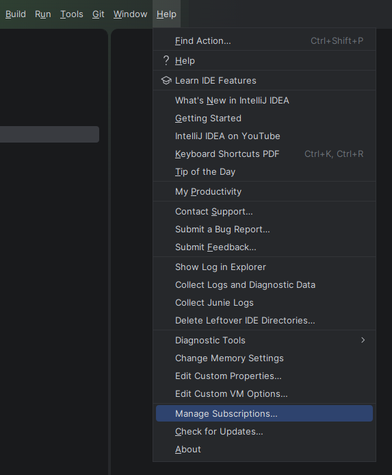
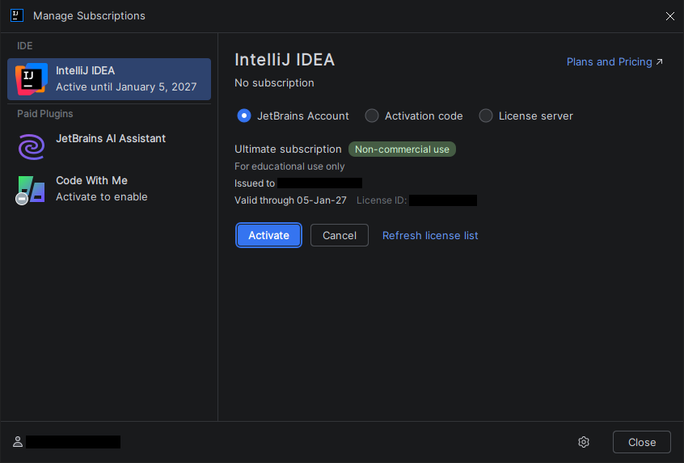
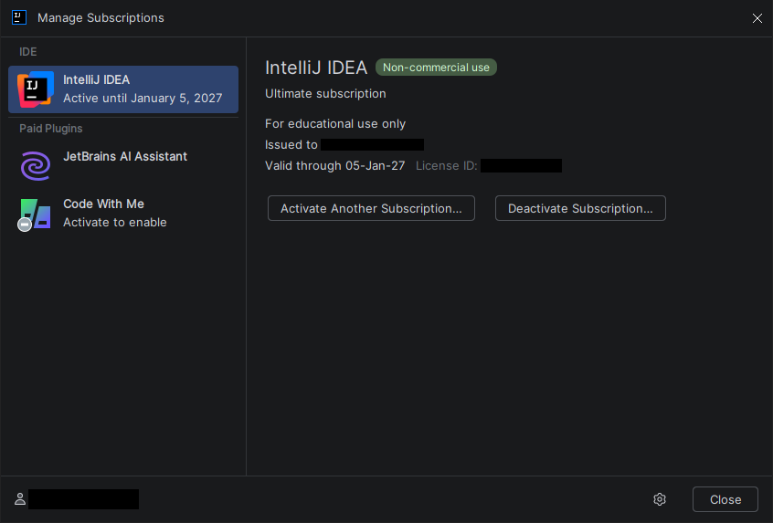
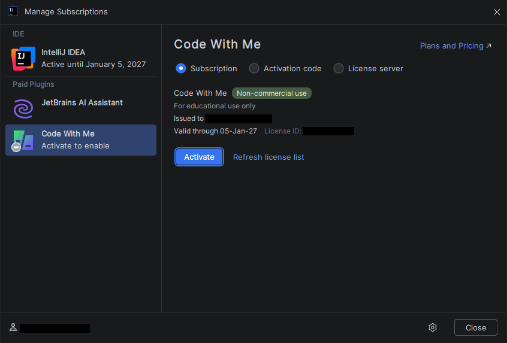

# CSE 342: Advanced Programming

In this advanced programming course, we will learn the fundamentals of Object Oriented Programming (**OOP**) using **Java**. Since **3 billion** software runs **Java**, it is the language of choice for advanced programming.

- [**📌 Course Outline: Theory**](materials/course-outline-theory.pdf)
- [**📌 Course Outline: Lab**](materials/course-outline-lab.pdf)

## Course Information

```
Course Code   : CSE 341-342
Course Title  : Advanced Programming
Course Credit : 3 (Theory), 1.5 (Lab)
```

Course offered by,

[**Most. Jannatul Ferdous**](https://www.bubt.edu.bd/department/27/faculty/profile/841)<br>Assistant Professor<br>Department of Computer Science and Engineering<br>**jannatul_ferdous@bubt.edu.bd**<br>+880 172 3586 258<br>B1/303

## Recommended Book

- [**📘 Java The Complete Reference, 7th Edition by Herbert Schildt**](materials/textbook.pdf)

## Class Notes

- [**Class 01**](https://shadowshahriar.github.io/cse342/notes/class-01.pdf): 05 January 2026
- [**Class 02**](https://shadowshahriar.github.io/cse342/notes/class-02.pdf): 08 January 2026

## Lab Notes

- [**Lab 01**](https://shadowshahriar.github.io/cse342/lab/01-2026-01-07/note.pdf): 07 January 2026
- **Lab 02**: 14 January 2026

## Lab Reports

- **Lab 01**: 07 January 2026
- [**Lab 02**](https://shadowshahriar.github.io/cse342/lab/02-2026-01-14/report.pdf): 14 January 2026

## Java IDEs

- [**NetBeans**](https://netbeans.apache.org/front/main/index.html)
- [**Eclipse**](https://www.eclipse.org/downloads/packages/)
- [**IntelliJ IDEA**](https://www.jetbrains.com/idea/) ![][TGB]
- [**JCreator**](https://jcreator.en.softonic.com/download)

[TGB]: assets/icons/tag-blue.svg 'Recommended'

## Installing IntelliJ IDEA

- Head over to the [**JetBrains Academy Page**](https://www.jetbrains.com/academy/student-pack/) and [**fill-up the form**](https://www.jetbrains.com/shop/eform/students) to request an Education license.
    - Select the **GitHub** tab if you already have the **GitHub Student Developer Pack**. Sign in to your GitHub account and authorize.
    - Once your student mail is verified, you should receive an email with further instructions. You will need to create a JetBrains account using the same GitHub account.

- Having done that, download the [**toolbox app**](https://www.jetbrains.com/toolbox-app/) and install the latest version of **IntelliJ IDEA**.

- From the menubar, go to **Help > Manage Subscriptions...**
  

- Login to your **JetBrains account** (if you haven't already) and click **Activate**.
  

- If everything goes right, your IDE should be activated.
  

- **Bonus:** You can also select **Code With Me** from the sidebar and activate it using the same license.
  
