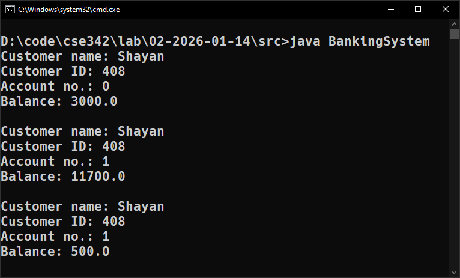
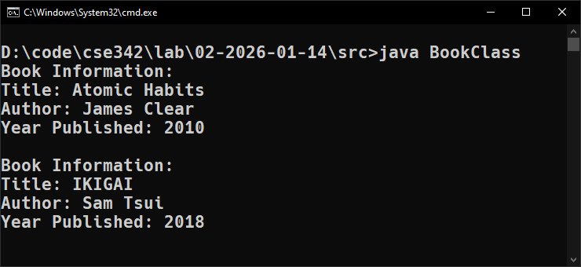
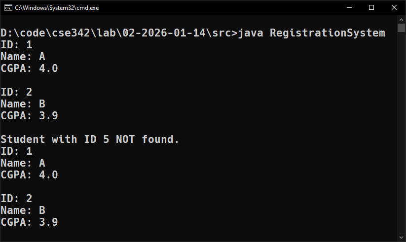

::: {#cover.border}

<section>
	
</section>
<section>
	<p class="h1 w800 underline text-upr">Lab Report</p>
	<table class="compact borderless table-large table-upr padless" style="width: 5.1in">
		<tr>
			<th>Course Title</th>
			<th>:</th><td>Advanced Programming Lab</td>
		</tr>
		<tr>
			<th>Course Code</th>
			<th>:</th><td>CSE 342</td>
		</tr>
		<tr>
			<th>Lab Report No.</th>
			<th>:</th><td>02</td>
		</tr>
		<tr>
			<th>Submission Date</th>
			<th>:</th><td>21-01-2026</td>
		</tr>
	</table>
</section>
<section style="--hw: 7.2rem;">
	<p class="h2 w800 text-upr">Submitted To</p>
	<table class="compact borderless table-large table-upr padless withleader">
		<tr>
			<th>Name</th>
			<td>Most. Jannatul Ferdous</td>
		</tr>
		<tr>
			<th>Dept. of</th>
			<td>Computer Science and Engineering (CSE)</td>
		</tr>
		<tr>
			<th></th>
			<td>Bangladesh University of Business & Technology (BUBT)</td>
		</tr>
	</table>
</section>
<section style="--hw: 7.2rem;">
	<p class="h2 w800 text-upr">Submitted By</p>
	<table class="compact borderless table-large table-upr padless withleader">
		<tr>
			<th>Name</th>
			<td>Shadman Shahriar</td>
		</tr>
		<tr>
			<th>ID No.</th>
			<td>20245103408</td>
		</tr>
		<tr>
			<th>Intake</th>
			<td>53</td>
		</tr>
		<tr>
			<th>Section</th>
			<td>1</td>
		</tr>
		<tr>
			<th>Program</th>
			<td>B.Sc. Engg. in CSE</td>
		</tr>
	</table>
</section>

:::

::: {.centered-heading}

# Advanced Programming

:::

## Banking System

Consider a simple bank account system where you have customers and their bank accounts.

- Each customer has a name, a unique identifier, and can have one or more bank accounts.
- Each bank account has an account number, a balance, and belongs to a specific customer.

Design a set of Java classes to model this bank account system. Your implementation should include the following features:

**Customer Class**

- Attributes: `name`, `customerID`, `bankAccount`
- Methods: a method to add a bank account, a method to display customer information, methods to deposit and withdraw money.

**BankAccount Class**

- Attributes: `accountNumber`, `balance`
- Methods: a method to deposit money, a method to withdraw money, a method to display account information.

Create `Customer` and `BankAccount` objects. And only using the customer object, deposit or withdraw money.

**Ans.** Here is a Java program that implements a system banking system using two classes: `Customer` and `BankAccount`:

```CPP
/**
 * ======================
 * Name: Shadman Shahriar
 * ID  : 20245103408
 * ======================
 */

class BankAccount {
    private int accountNumber;
    private double balance = 500.0;

    BankAccount(int accountNumber) {
        this.accountNumber = accountNumber;
    }

    void depositMoney(double amount) {
        balance += amount;
    }

    void withdrawMoney(double amount) {
        if(amount > balance || (balance - amount) < 500)
            System.out.println("Cannot withdraw money from A/C "+ accountNumber +": Insufficient funds");
        else
            balance -= amount;
    }

    void displayInformation() {
        System.out.println("Account no.: " + accountNumber + "\nBalance: " + balance + "\n");
    }
}

class Customer {
    private String name;
    private int customerID;
    private int activeAccounts = 0;
    BankAccount[] bankAccount = new BankAccount[50];

    Customer(String name, int customerID) {
        this.name = name;
        this.customerID = customerID;
    }

    void addAccount() {
        bankAccount[activeAccounts] = new BankAccount(activeAccounts);
        activeAccounts++;
    }

    void depositTo(int accountNumber, double amount) {
        bankAccount[accountNumber].depositMoney(amount);
    }

    void withdrawFrom(int accountNumber, double amount) {
        bankAccount[accountNumber].withdrawMoney(amount);
    }

    void displayAccountInfo(int accountNumber) {
        System.out.println("Customer name: " + name);
        System.out.println("Customer ID: " + customerID);
        bankAccount[accountNumber].displayInformation();
    }
}

public class BankingSystem {
    public static void main(String[] args) {
        Customer C1 = new Customer("Shayan", 408);
        C1.addAccount();
        C1.addAccount();

        C1.depositTo(0, 2500);
        C1.displayAccountInfo(0);

        C1.depositTo(1, 11200);
        C1.displayAccountInfo(1);

        C1.withdrawFrom(1, 11200);
        C1.displayAccountInfo(1);
    }
}
```

**Output:** The code yields the following output in the terminal:

```diff
Customer name: Shayan
Customer ID: 408
Account no.: 0
Balance: 3000.0

Customer name: Shayan
Customer ID: 408
Account no.: 1
Balance: 11700.0

Customer name: Shayan
Customer ID: 408
Account no.: 1
Balance: 500.0
```



## Book

Write a Java program to create a class named `Book` that represents basic information about a book in a library.

- The class should have three attributes: `title` (**String**), author (**String**), and `yearPublished` (**int**)
- Include a constructor to initialize these fields and a method called `displayInfo()` that prints the book's details.

In the `main` method, create at least two objects of the `Book` class with different data and call the `displayInfo()` method for each to display their information.

**Ans.** Here is a Java program that implements a `Book` class satisfying the above conditions:

```CPP
/**
 * ======================
 * Name: Shadman Shahriar
 * ID  : 20245103408
 * ======================
 */

class Book {
    private String title, author;
    private int yearPublished;

    Book(String title, String author, int yearPublished) {
        this.title = title;
        this.author = author;
        this.yearPublished = yearPublished;
    }

    void displayInfo() {
        System.out.println("Book Information:"
                + "\nTitle: " + title
                + "\nAuthor: " + author
                + "\nYear Published: " + yearPublished
				+ "\n"
        );
    }
}

public class BookClass {
    public static void main(String[] args) {
        Book B1 = new Book("Atomic Habits", "James Clear", 2010);
        Book B2 = new Book("IKIGAI", "Sam Tsui", 2018);
        B1.displayInfo();
        B2.displayInfo();
    }
}
```

**Output:** The code yields the following output in the terminal:

```diff
Book Information:
Title: Atomic Habits
Author: James Clear
Year Published: 2010

Book Information:
Title: IKIGAI
Author: Sam Tsui
Year Published: 2018
```



## Metro Ticket

Design a `MetroTicket` class to simulate a metro ticket booking system using **constructor overloading**. Passengers can book tickets with different levels of information.

- Some may provide only their name, source, and destination;
- others may include whether it’s a round trip,
- choose between "Regular" or "Premium" seat classes,
- and even apply discount codes.

The class should have (at least) **four overloaded constructors** to handle these scenarios. Use **constructor chaining** to avoid code repetition.

- Include validations—for instance, seat class must be either **Regular** or **Premium**, and if an invalid value is given, default to **Regular**.
- Implement methods like `calculateFare()` to compute the fare based on trip type and seat class (e.g., **one-way Regular = 100, Premium = 150; round-trip Regular = 180, Premium = 270**), with a 10% discount if the code (**DIS10**) is applied.
- Also, write a `displayTicketDetails()` method to show all ticket information. Create at least four objects using different constructors to demonstrate constructor overloading effectively.

**Ans.** Here is a Java program that implements a `MetroTicket` class satisfying the above conditions:

```CPP
/**
 * ======================
 * Name: Shadman Shahriar
 * ID  : 20245103408
 * ======================
 */

import java.util.Objects;

class MetroTicket{
    String name;
    String source;
    String destination;
    boolean roundTrip = false;
    String seatClass = "Regular";
    String discountCode = "N/A";
    double fareFactor = 1;
    double fare = 0;

    MetroTicket(String name, String source, String destination){
        this.name = name;
        this.source = source;
        this.destination = destination;
    }

    MetroTicket(String name, String source, String destination, boolean roundTrip){
        this.name = name;
        this.source = source;
        this.destination = destination;
        this.roundTrip = roundTrip;
    }

    MetroTicket(String name, String source, String destination, boolean roundTrip, String seatClass){
        this.name = name;
        this.source = source;
        this.destination = destination;
        this.roundTrip = roundTrip;
        this.seatClass = (Objects.equals(seatClass, "Premium") ? "Premium" : "Regular");
    }

    MetroTicket(String name, String source, String destination, String seatClass){
        this.name = name;
        this.source = source;
        this.destination = destination;
        this.seatClass = (Objects.equals(seatClass, "Premium") ? "Premium" : "Regular");
    }

    MetroTicket(String name, String source, String destination, boolean roundTrip, String seatClass, String discountCode){
        this.name = name;
        this.source = source;
        this.destination = destination;
        this.seatClass = (Objects.equals(seatClass, "Premium") ? "Premium" : "Regular");
        this.discountCode = discountCode;
        this.fareFactor = (Objects.equals(discountCode, "DIS10") ? 0.9 : 1);
    }

    MetroTicket(String name, String source, String destination, String seatClass, String discountCode){
        this.name = name;
        this.source = source;
        this.destination = destination;
        this.seatClass = (Objects.equals(seatClass, "Premium") ? "Premium" : "Regular");
        this.discountCode = discountCode;
        this.fareFactor = (Objects.equals(discountCode, "DIS10") ? 0.9 : 1);
    }

    void calculateFare(){
        fare = 0.0;
        if(seatClass == "Premium" && roundTrip) {
            fare = 270;
        } else if(seatClass == "Regular" && roundTrip) {
            fare = 180;
        } else if(seatClass == "Premium") {
            fare = 150;
        } else if(seatClass == "Regular") {
            fare = 100;
        }
        fare = fare * fareFactor;
    }

    void displayTicketDetails(){
        calculateFare();
        System.out.println("Name: " + name);
        System.out.println("Source: " + source);
        System.out.println("Destination: " + destination);
        System.out.println("Discount Code: " + discountCode);
        System.out.println("Is Round Trip?: " + roundTrip);
        System.out.println("Seat Class: " + seatClass);
        System.out.println("Fare: " + fare + "\n");
    }
}

public class MetroRailService {
    public static void main(String[] args){
        MetroTicket M1 = new MetroTicket("Shayan", "Motijheel", "Uttara");
        MetroTicket M2 = new MetroTicket("Shayan", "A", "B", true);
        MetroTicket M3 = new MetroTicket("Shayan", "A", "B", "Premium");
        MetroTicket M4 = new MetroTicket("Shayan", "A", "B", true,"Premium");
        MetroTicket M5 = new MetroTicket("Shayan", "A", "B", true,"Premium", "DIS10");
        MetroTicket M6= new MetroTicket("Shayan", "A", "B", true,"Regular", "DIS10");

        M1.displayTicketDetails();
        M2.displayTicketDetails();
        M3.displayTicketDetails();
        M4.displayTicketDetails();
        M5.displayTicketDetails();
        M6.displayTicketDetails();
    }
}
```

**Output:** The code yields the following output in the terminal:

```diff
Name: Shayan
Source: Motijheel
Destination: Uttara
Discount Code: N/A
Is Round Trip?: false
Seat Class: Regular
Fare: 100.0

Name: Shayan
Source: A
Destination: B
Discount Code: N/A
Is Round Trip?: true
Seat Class: Regular
Fare: 180.0

Name: Shayan
Source: A
Destination: B
Discount Code: N/A
Is Round Trip?: false
Seat Class: Premium
Fare: 150.0

Name: Shayan
Source: A
Destination: B
Discount Code: N/A
Is Round Trip?: true
Seat Class: Premium
Fare: 270.0

Name: Shayan
Source: A
Destination: B
Discount Code: DIS10
Is Round Trip?: false
Seat Class: Premium
Fare: 135.0

Name: Shayan
Source: A
Destination: B
Discount Code: DIS10
Is Round Trip?: false
Seat Class: Regular
Fare: 90.0
```


## Student Registration System

A department registers students for a course using a **fixed-size system**. Each student has a **student ID**, **name**, and **CGPA**.

The administrator can:

- Register a new student
- Search a student by ID
- Display all registered students
- Remove a student\*

Implement the system using an array of `Student` objects.

**Ans.** Here is a Java program satisfies the given conditions:

```CPP
/**
 * ======================
 * Name: Shadman Shahriar
 * ID  : 20245103408
 * ======================
 */

class Student {
    private int studentID;
    private String name;
    private double CGPA;

    Student(int studentID, String name, double CGPA) {
        this.studentID = studentID;
        this.name = name;
        this.CGPA = CGPA;
    }

    void display() {
        System.out.println("ID: " + studentID);
        System.out.println("Name: " + name);
        System.out.println("CGPA: " + CGPA + "\n");
    }

    boolean getID(int num) {
        return this.studentID == num;
    }
}

class Registerar {
    int registered = 0;
    Student students[] = new Student[100];

    void registerNewStudent(int studentID, String name, double CGPA){
        if(registered >= 100) {
            System.out.println("Cannot register new student: No available seats");
        }else{
            students[registered] = new Student(studentID, name, CGPA);
            registered++;
        }
    }

    void displayAll() {
        for(int i = 0; i < registered; i++){
            students[i].display();
        }
    }

    void searchStudent(int studentID) {
        for(int i = 0; i < registered; i++){
            if(students[i].getID(studentID)){
                System.out.println("Student Found.");
                students[i].display();
                return;
            }
        }
        System.out.println("Student NOT Found.");
    }

    void removeStudent(int studentID) {
        Student[] students_temp = new Student[100];
        int j = 0;
        boolean wasRemoved = false;
        for(int i = 0; i < registered; i++){
            if(students[i].getID(studentID)){
                wasRemoved = true;
            }else{
                students_temp[j] = students[i];
                j++;
            }
        }
        students = students_temp;
        if(wasRemoved){
            System.out.println("Student with ID " + studentID + " was removed.");
            registered--;
        }else{
            System.out.println("Student with ID " + studentID + " NOT found.");
        }
    }
}

public class RegistrationSystem {
    public static void main(String[] args) {
        Registerar R = new Registerar();
        R.registerNewStudent(1, "A", 4.00);
        R.registerNewStudent(2, "B", 3.90);
        // R.registerNewStudent(3, "C", 3.93);
        // R.registerNewStudent(4, "D", 3.72);
        // R.registerNewStudent(5, "E", 3.11);
        // R.registerNewStudent(6, "F", 1.44);
        R.displayAll();

        // R.searchStudent(3);
        // R.searchStudent(44);
        R.removeStudent(5);
        R.displayAll();
    }
}
```

**Output:** The code yields the following output in the terminal:

```diff
ID: 1
Name: A
CGPA: 4.0

ID: 2
Name: B
CGPA: 3.9

Student with ID 5 NOT found.
ID: 1
Name: A
CGPA: 4.0

ID: 2
Name: B
CGPA: 3.9
```


