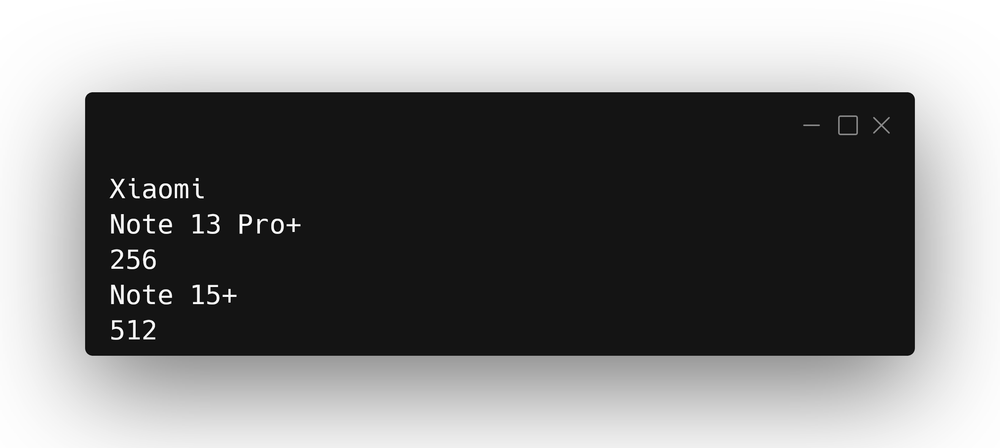
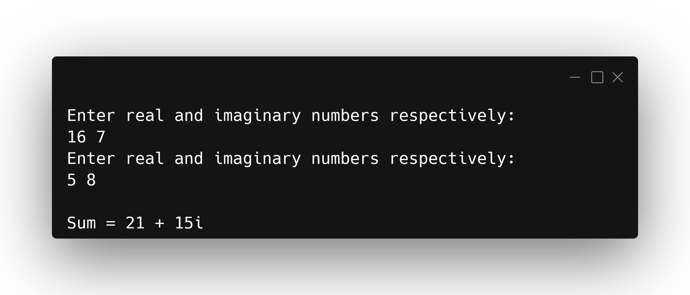
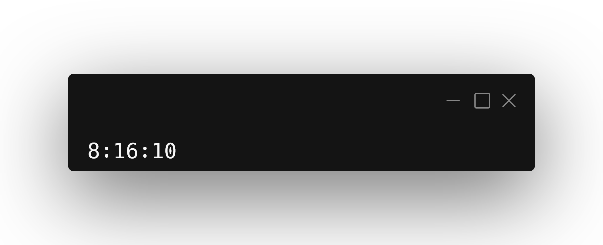
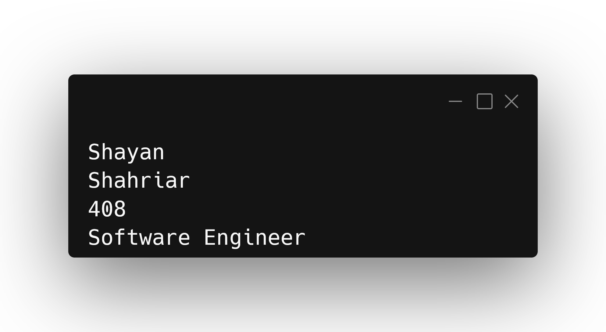
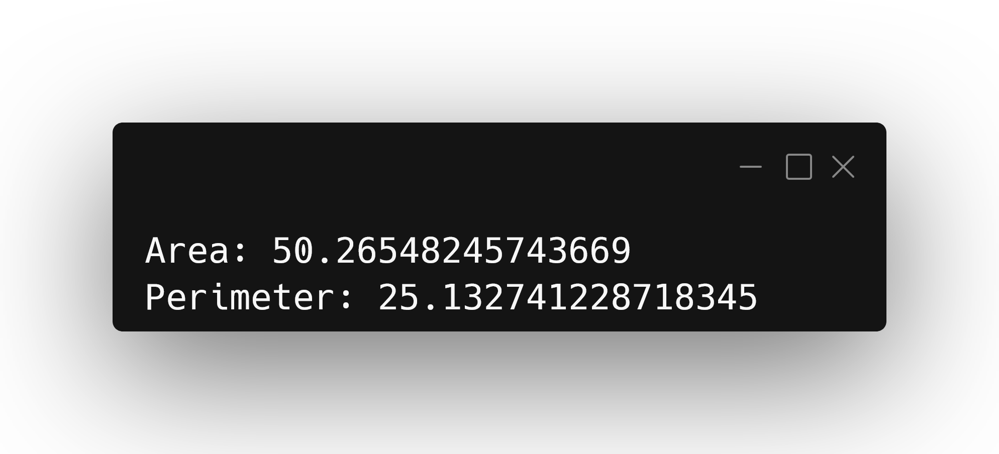
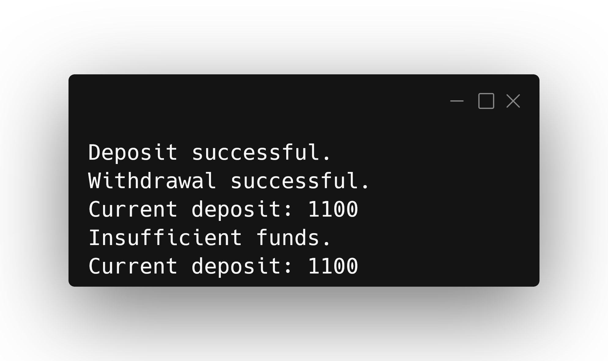
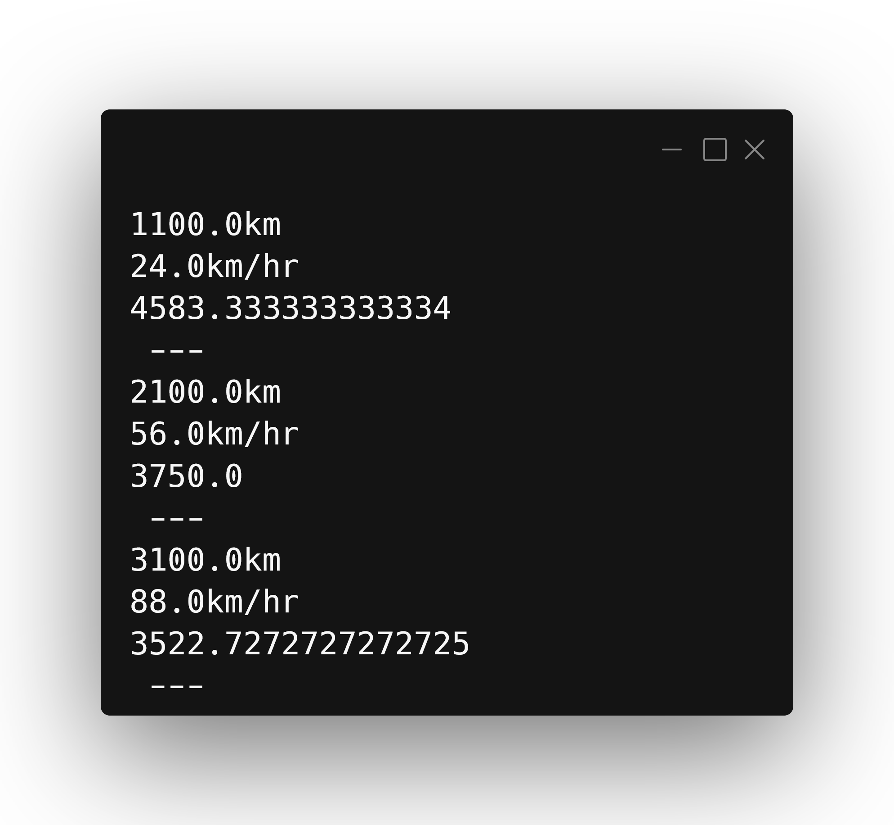
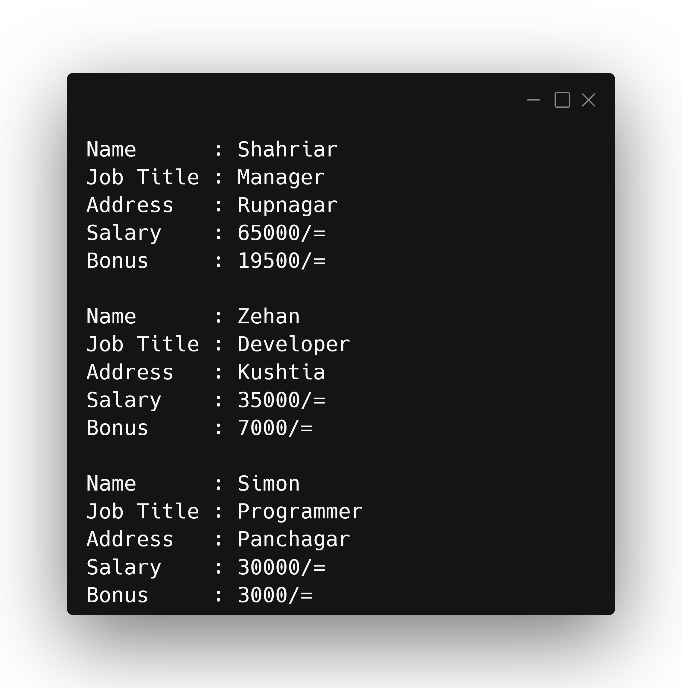
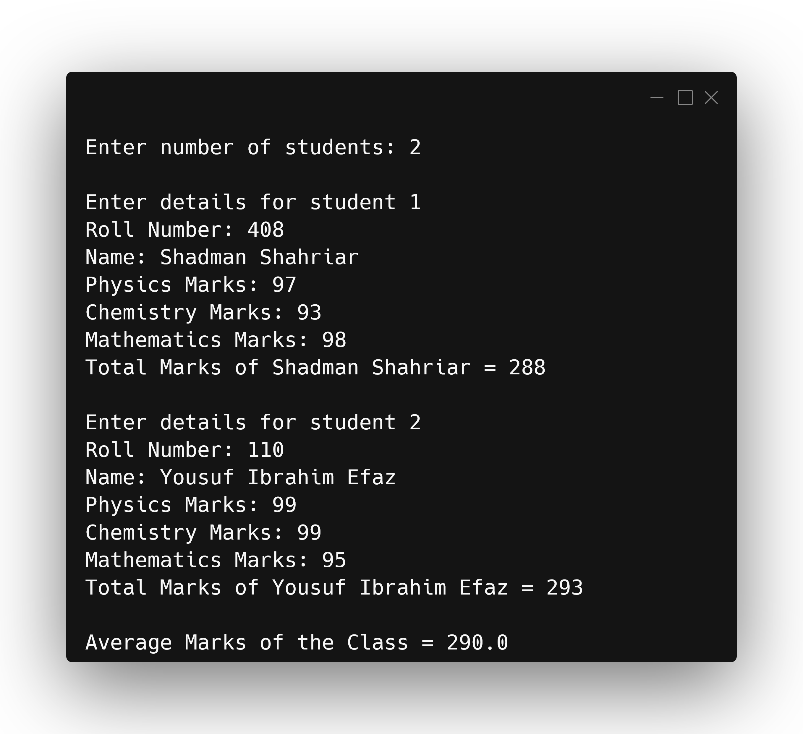

::: {#cover.border}

<section>
	
</section>
<section>
	<p class="h1 w800 underline text-upr">Lab Report</p>
	<table class="compact borderless table-large table-upr padless" style="width: 5.1in">
		<tr>
			<th>Course Title</th>
			<th>:</th><td>Advanced Programming Lab</td>
		</tr>
		<tr>
			<th>Course Code</th>
			<th>:</th><td>CSE 342</td>
		</tr>
		<tr>
			<th>Lab Report No.</th>
			<th>:</th><td>03</td>
		</tr>
		<tr>
			<th>Submission Date</th>
			<th>:</th><td>28-01-2026</td>
		</tr>
	</table>
</section>
<section style="--hw: 7.2rem;">
	<p class="h2 w800 text-upr">Submitted To</p>
	<table class="compact borderless table-large table-upr padless withleader">
		<tr>
			<th>Name</th>
			<td>Most. Jannatul Ferdous</td>
		</tr>
		<tr>
			<th>Dept. of</th>
			<td>Computer Science and Engineering (CSE)</td>
		</tr>
		<tr>
			<th></th>
			<td>Bangladesh University of Business & Technology (BUBT)</td>
		</tr>
	</table>
</section>
<section style="--hw: 7.2rem;">
	<p class="h2 w800 text-upr">Submitted By</p>
	<table class="compact borderless table-large table-upr padless withleader">
		<tr>
			<th>Name</th>
			<td>Shadman Shahriar</td>
		</tr>
		<tr>
			<th>ID No.</th>
			<td>20245103408</td>
		</tr>
		<tr>
			<th>Intake</th>
			<td>53</td>
		</tr>
		<tr>
			<th>Section</th>
			<td>1</td>
		</tr>
		<tr>
			<th>Program</th>
			<td>B.Sc. Engg. in CSE</td>
		</tr>
	</table>
</section>

:::

::: {.centered-heading}

# Advanced Programming

:::

## Smartphone Class

Write a Java program to create a class called **Smartphone** with private instance variables `brand`, `model`, and `storageCapacity`. Provide **public** getter and setter methods to access and modify these variables. Add a method called `increaseStorage()` that takes an **integer value** and increases the `storageCapacity` by that value.

**Ans.** Here is a Java program that implements the `Smartphone` class:

```Java
/**
 * ======================
 * Name: Shadman Shahriar
 * ID  : 20245103408
 * ======================
 */

class Smartphone {
    private String brand, model;
    private int storageCapacity;

    Smartphone(String brand, String model, int storageCapacity) {
        this.brand = brand;
        this.model = model;
        this.storageCapacity = storageCapacity;
    }

    String getBrand() {
        return brand;
    }

    String getModel() {
        return model;
    }

    int getCapacity() {
        return storageCapacity;
    }

    void setBrand(String brand){
        this.brand = brand;
    }

    void setModel(String model){
        this.model = model;
    }

    void setStorage(int storageCapacity){
        this.storageCapacity = storageCapacity;
    }

    void increaseStorage(int capacity){
        this.storageCapacity += capacity;
    }
}

public class SmartphoneClass {
    public static void main(String[] args) {
        Smartphone sp = new Smartphone("Xiaomi", "Note 13 Pro+", 256);
        System.out.println(sp.getBrand());
        System.out.println(sp.getModel());
        System.out.println(sp.getCapacity());

        sp.setModel("Note 15+");
        sp.increaseStorage(256);
        System.out.println(sp.getModel());
        System.out.println(sp.getCapacity());
    }
}
```

**Output:** The code yields the following output in the terminal:

```diff
Xiaomi
Note 13 Pro+
256
Note 15+
512
```



## Complex Class

Create a class named **Complex** that must have two integer data members (`real`, and `imag`). Create two constructors, one `Read` function to take keyboard input, one `Add` (return object), function, and one `Display` function to print results. The `Add` function **must take one object as an argument**.

**Example:**

```diff
  Enter real and imaginary numbers respectively:
+ 16 7
  Enter real and imaginary numbers respectively:
+ 5 8

  Sum = 21 + 15i
```

**Ans.** Here is a Java program that implements the `Complex` class:

```Java
/**
 * ======================
 * Name: Shadman Shahriar
 * ID  : 20245103408
 * ======================
 */

import java.util.Scanner;

class Complex {
    int real, imag;

    Complex() {
        real = 3;
        imag = 4;
    }

    Complex(int real, int imag) {
        this.real = real;
        this.imag = imag;
    }

    void Read() {
        Scanner sc = new Scanner(System.in);
        int R, I;
        System.out.println("Enter real and imaginary numbers respectively: ");
        R = sc.nextInt();
        I = sc.nextInt();

        this.real = R;
        this.imag = I;
    }

    Complex Add(Complex ob){
        Complex temp = new Complex(this.real + ob.real, this.imag + ob.imag);
        return temp;
    }

    void Display() {
        System.out.println("Sum = " + real + " + " + imag + "i");
    }
}

public class ComplexClass {
    public static void main(String[] args) {
        Complex num1 = new Complex();
        num1.Read();

        Complex num2 = new Complex();
        num2.Read();

        Complex num3 = num1.Add(num2);
        num3.Display();
    }
}
```

**Output:** The code yields the following output in the terminal:

```diff
  Enter real and imaginary numbers respectively:
+ 16 7
  Enter real and imaginary numbers respectively:
+ 5 8

  Sum = 21 + 15i
```



## Time Class

Create a class named `Time` that must have three integer data members (`hours`, `minutes`, and `seconds`). Create **two constructors**, one member function named `add_time` (return object), and one `display` function to print the time in `11:59:59` format. The `add_time` function must take two objects as arguments. The main function calls the `add_time` function to add two time objects and store the result in a third object. Use the `display` function to print the result on the console.

```
Input : 2 55 40, 5 20 30
Output: 8:16:10
```

**Ans.** Here is a Java program that implements the `Time` class:

```Java
/**
 * ======================
 * Name: Shadman Shahriar
 * ID  : 20245103408
 * ======================
 */

```

**Output:** The code yields the following output in the terminal:

```diff
8:16:10
```



## Person Class

Write a Java program to create a class known as `Person` with methods called `getFirstName()` and `getLastName()`. Create a child class called `Employee` that adds a new method named `getEmployeeId()` and accesses the `getLastName()` method to include the employee's job title.

**Ans.** Here is a Java program that implements the `Person` class:

```Java
/**
 * ======================
 * Name: Shadman Shahriar
 * ID  : 20245103408
 * ======================
 */

class Person {
    String firstName, lastName;
    Person(String firstName, String lastName) {
        this.firstName = firstName;
        this.lastName = lastName;
    }

    String getFirstName(){
        return firstName;
    }

    String getLastName(){
        return lastName;
    }
}

class Employee extends Person {
    int empID;
    String jobTitle;

    Employee(String firstName, String lastName, int empID, String jobTitle) {
        super(firstName,lastName);
        this.empID = empID;
        this.jobTitle = jobTitle;
    }

    int getEmployeeID(){
        return empID;
    }

    String getJobTitle(){
        return jobTitle;
    }
}

public class PersonClass {
    public static void main(String[] args) {
        Employee emp = new Employee("Shayan", "Shahriar", 408, "Software Engineer");
        System.out.println(emp.getFirstName());
        System.out.println(emp.getLastName());
        System.out.println(emp.getEmployeeID());
        System.out.println(emp.getJobTitle());
    }
}
```

**Output:** The code yields the following output in the terminal:

```diff
Shayan
Shahriar
408
Software Engineer
```



## Shape Class

Write a Java program to create a class called **Shape** with methods called `getPerimeter()` and `getArea()`. Create a child class called **Circle** that uses the `getPerimeter()` and `getArea()`
methods to calculate the area and perimeter of a circle.

**Ans.** Here is a Java program that implements `Shape` and `Circle` classes:

```Java
/**
 * ======================
 * Name: Shadman Shahriar
 * ID  : 20245103408
 * ======================
 */

import java.lang.Math;

class Shape {
    double value;

    Shape(double value) {
        this.value = value;
    }

    double getPerimeter(){
        return 1.0;
    }

    double getArea(){
        return 1.0;
    }
}

class Circle extends Shape {
    Circle(double radius) {
        super(radius);
    }

    double getPerimeter(){
        return 2 * Math.PI * value;
    }

    double getArea(){
        return Math.PI * (Math.pow(value, 2));
    }
}

public class ShapeClass {
    public static void main(String[] args) {
        Circle c = new Circle(4);
        System.out.println(
                "Area: " + c.getArea() +
                        "\nPerimeter: " + c.getPerimeter()
        );
    }
}
```

**Output:** The code yields the following output in the terminal:

```diff
Area: 50.26548245743669
Perimeter: 25.132741228718345
```



## BankAccount Class

Write a Java program to create a class known as **BankAccount** with methods called `deposit()` and `withdraw()`. Create a child class called **SavingsAccount** that acesses the `withdraw()` method to **prevent withdrawals if the account balance falls below one hundred**.

**Ans.** Here is a Java program that implements `BankAccount` and `SavingsAccount` classes:

```Java
/**
 * ======================
 * Name: Shadman Shahriar
 * ID  : 20245103408
 * ======================
 */

class BankAccount {
    int amount = 100;
    BankAccount(int amount){
        if(amount > 100){
            this.amount = amount;
        }
    }

    void deposit(int amount){
        if(amount > 0){
            this.amount += amount;
            System.out.println("Deposit successful.");
        }else{
            System.out.println("Negative number.");
        }
    }

    void withdraw(){

    }

    void display(){
        System.out.println("Current deposit: " + amount);
    }
}

class SavingsAccount extends BankAccount {
    SavingsAccount(int amount){
        super(amount);
    }

    void withdraw(int amount){
        if(amount > this.amount || this.amount - amount < 100){
            System.out.println("Insufficient funds.");
        }else{
            this.amount -= amount;
            System.out.println("Withdrawal successful.");
        }
    }
}

public class BankAccountClass {
    public static void main(String[] args) {
        SavingsAccount sac = new SavingsAccount(1200);
        sac.deposit(300);
        sac.withdraw(400);
        sac.display();
        sac.withdraw(2000);
        sac.display();
    }
}
```

**Output:** The code yields the following output in the terminal:

```diff
Deposit successful.
Withdrawal successful.
Current deposit: 1100
Insufficient funds.
Current deposit: 1100
```



## Vehicle Class

Write a Java program to create a vehicle class hierarchy. The base class should be **Vehicle**, with child classes **Truck**, **Car** and **Motorcycle**. Each child class should have properties such as make model, year, and fuel type. Implement methods for calculating fuel efficiency, distance traveled, and maximum speed.

**Ans.** Here is a Java program that implements the given classes:

```Java
/**
 * ======================
 * Name: Shadman Shahriar
 * ID  : 20245103408
 * ======================
 */

class Vehicle {
    String maker, model, fuelType;
    int year;
    double distance, speed;
    double efficiencyFactor = 1;

    Vehicle(String maker, String model, String fuelType, int year){
        this.maker = maker;
        this.model = model;
        this.fuelType = fuelType;
        this.year = year;
    }

    void setDistanceSpeed(double distance, double speed){
        this.distance = distance;
        this.speed = speed;
    }

    void distanceTraveled(){
        System.out.println(distance + "km");
    }

    void maximumSpeed(){
        System.out.println((speed * efficiencyFactor) + "km/hr");
    }

    void calcFuelEfficiency(){
        System.out.println((distance / (speed * efficiencyFactor)) * 100);
    }
}

class Truck extends Vehicle {
    double efficiencyFactor = 0.35;
    Truck(String maker, String model, String fuelType, int year){
        super(maker,model,fuelType,year);
    }
}

class Car extends Vehicle {
    double efficiencyFactor = 0.7;
    Car(String maker, String model, String fuelType, int year){
        super(maker,model,fuelType,year);
    }
}

class Motorcylce extends Vehicle {
    double efficiencyFactor = 0.8;
    Motorcylce(String maker, String model, String fuelType, int year){
        super(maker,model,fuelType,year);
    }
}

public class VehicleClass {
    public static void main(String[] args) {
        Truck t1 = new Truck("Toyota", "Corolla", "petrol", 2019);
        t1.setDistanceSpeed(1100,24);
        t1.distanceTraveled();
        t1.maximumSpeed();
        t1.calcFuelEfficiency();
        System.out.println(" --- ");

        Car c1 = new Car("Toyota", "Motorolla", "electricity", 2022);
        c1.setDistanceSpeed(2100,56);
        c1.distanceTraveled();
        c1.maximumSpeed();
        c1.calcFuelEfficiency();
        System.out.println(" --- ");

        Motorcylce m1 = new Motorcylce("Toyota", "Hero", "disel", 2024);
        m1.setDistanceSpeed(3100,88);
        m1.distanceTraveled();
        m1.maximumSpeed();
        m1.calcFuelEfficiency();
        System.out.println(" --- ");
    }
}
```

**Output:** The code yields the following output in the terminal:

```diff
1100.0km
24.0km/hr
4583.333333333334
 ---
2100.0km
56.0km/hr
3750.0
 ---
3100.0km
88.0km/hr
3522.7272727272725
 ---
```



## Employee Class

Write a Java program that creates a class hierarchy for employees of a company. The base class should be **Employee**, with child classes **Manager**, **Developer**, and **Programmer**. Each child class should have properties such as name, address, salary, and job title. Implement methods for calculating bonuses, generating performance reports, and managing projects.

**Ans.** Here is a Java program that implements the given classes:

```Java
/**
 * ======================
 * Name: Shadman Shahriar
 * ID  : 20245103408
 * ======================
 */

class Employee {
	String name, address, job_title;
	int salary;
	double bonus_factor = 1;
	double bonus = 0;

	Employee(String name, String address, int salary) {
		this.name = name;
		this.address = address;
		this.salary = salary;
		this.job_title = "Employee";
	}

	void calculateBonus() {
		bonus = (salary * bonus_factor);
	}

	void display() {
		calculateBonus();
		System.out.println("Name      : " + name);
		System.out.println("Job Title : " + job_title);
		System.out.println("Address   : " + address);
		System.out.println("Salary    : " + salary + "/=");
		System.out.println("Bonus     : " + (int)bonus + "/=");
		System.out.println("");
	}
}

class Manager extends Employee {


	Manager(String name, String address, int salary) {
		super(name, address, salary);
		job_title = "Manager";
		bonus_factor = 0.3;
	}

	void manageProjects() {
		System.out.println("Managing Projects");
	}
}

class Developer extends Employee {

	Developer(String name, String address, int salary) {
		super(name, address, salary);
		job_title = "Developer";
		bonus_factor = 0.2;
	}

	void generateReports() {
		System.out.println("Generating performance reports");
	}
}

class Programmer extends Employee {

	Programmer(String name, String address, int salary) {
		super(name, address, salary);
		job_title = "Programmer";
		bonus_factor = 0.1;
	}

	void buildProgram() {
		System.out.println("Building programs");
	}
}

public class EmployeeClass {
	public static void main(String[] args) {
		Manager m = new Manager("Shahriar", "Rupnagar", 65000);
		Developer d = new Developer("Zehan", "Kushtia", 35000);
		Programmer p = new Programmer("Simon", "Panchagar", 30000);
		m.display();
		d.display();
		p.display();
	}
}
```

**Output:** The code yields the following output in the terminal:

```diff
Name      : Shahriar
Job Title : Manager
Address   : Rupnagar
Salary    : 65000/=
Bonus     : 19500/=

Name      : Zehan
Job Title : Developer
Address   : Kushtia
Salary    : 35000/=
Bonus     : 7000/=

Name      : Simon
Job Title : Programmer
Address   : Panchagar
Salary    : 30000/=
Bonus     : 3000/=
```



## Marks Class

We want to calculate the total marks of each student of a class in **Physics**, **Chemistry** and **Mathematics** and the average marks of the class. The number of students in the class are entered by the user. Create a class named **Marks** with data members for roll number, name and marks. Create three other classes inheriting the Marks class, namely **Physics, Chemistry and Mathematics**, which are used to define marks in individual subjects of each student.

**Ans.** Here is a Java program that satisfies the given conditions:

```Java
/**
 * ======================
 * Name: Shadman Shahriar
 * ID  : 20245103408
 * ======================
 */

import java.util.Scanner;

class Marks {
    int rollNo, marks;
    String name;

    void getStudentDetails(int rollNo, String name, int marks) {
        this.rollNo = rollNo;
        this.name = name;
        this.marks = marks;
    }
}

class Physics extends Marks {
}

class Chemistry extends Marks {
}

class Mathematics extends Marks {
}

public class MarksClass {
    public static void main(String[] args) {
        Scanner sc = new Scanner(System.in);
        System.out.print("Enter number of students: ");
        int n = sc.nextInt();

        Physics[] physics = new Physics[n];
        Chemistry[] chemistry = new Chemistry[n];
        Mathematics[] mathematics = new Mathematics[n];

        int classTotal = 0;
        for (int i = 0; i < n; i++) {
            physics[i] = new Physics();
            chemistry[i] = new Chemistry();
            mathematics[i] = new Mathematics();

            System.out.println("\nEnter details for student " + (i + 1));

            System.out.print("Roll Number: ");
            int roll = sc.nextInt();
            sc.nextLine();

            System.out.print("Name: ");
            String name = sc.nextLine();

            System.out.print("Physics Marks: ");
            int p = sc.nextInt();

            System.out.print("Chemistry Marks: ");
            int c = sc.nextInt();

            System.out.print("Mathematics Marks: ");
            int m = sc.nextInt();

            physics[i].getStudentDetails(roll, name, p);
            chemistry[i].getStudentDetails(roll, name, c);
            mathematics[i].getStudentDetails(roll, name, m);

            int total = p + c + m;
            classTotal += total;

            System.out.println("Total Marks of " + name + " = " + total);
        }

		double classAverage = classTotal / n;
		System.out.println("");
        System.out.println("Average Marks of the Class = " + classAverage);
        sc.close();
    }
}
```

**Output:** The code yields the following output in the terminal:

```diff
Enter number of students: 2

Enter details for student 1
Roll Number: 408
Name: Shadman Shahriar
Physics Marks: 97
Chemistry Marks: 93
Mathematics Marks: 98
Total Marks of Shadman Shahriar = 288

Enter details for student 2
Roll Number: 110
Name: Yousuf Ibrahim Efaz
Physics Marks: 99
Chemistry Marks: 99
Mathematics Marks: 95
Total Marks of Yousuf Ibrahim Efaz = 293

Average Marks of the Class = 290.0
```


